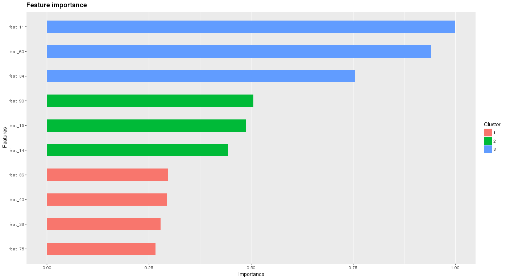

# xgboost in R demo  

## Getting started  
TransMapper is a light weighted web mapping application focusing on visualizing numeric data using the cartogram map, a map on which statistical information is shown in diagrammatic form. The project was the project submitted to 2013 Ohio State Big Data Hackathon sponsored by Google, Hortonworks, Teradata and USG,. The project is conceived, planned, executed and developed in 24 hours.

## Example results  
### Feature ranking (relative importance)  
Top 10 Features

Top 50 Features

