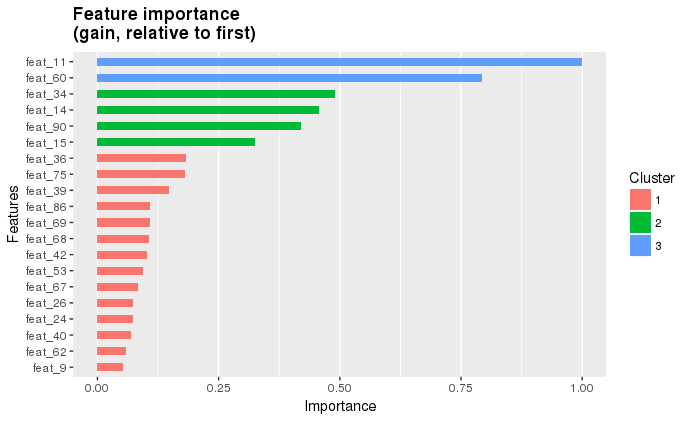
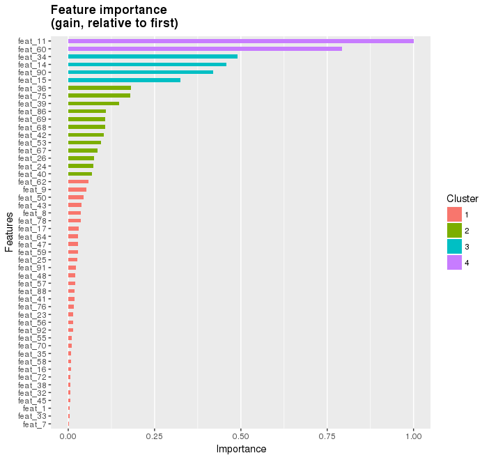

# xgboost R demo  
Problem: Kaggle Otto Group Product Classification Challenge 2015. Multi-class (9 classes, 93 features) product classification.

## Example results  
### Feature ranking  
Top 20 Features

Top 50 Features

First two trees (for first two classes)

